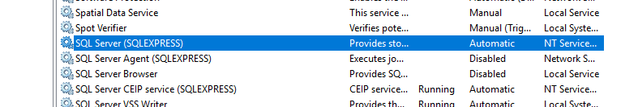
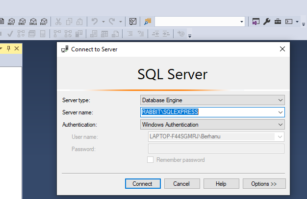
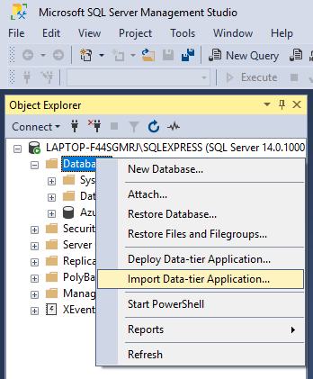
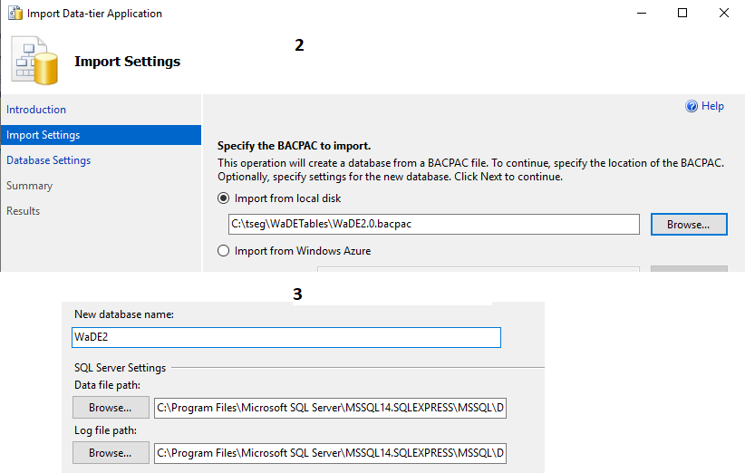
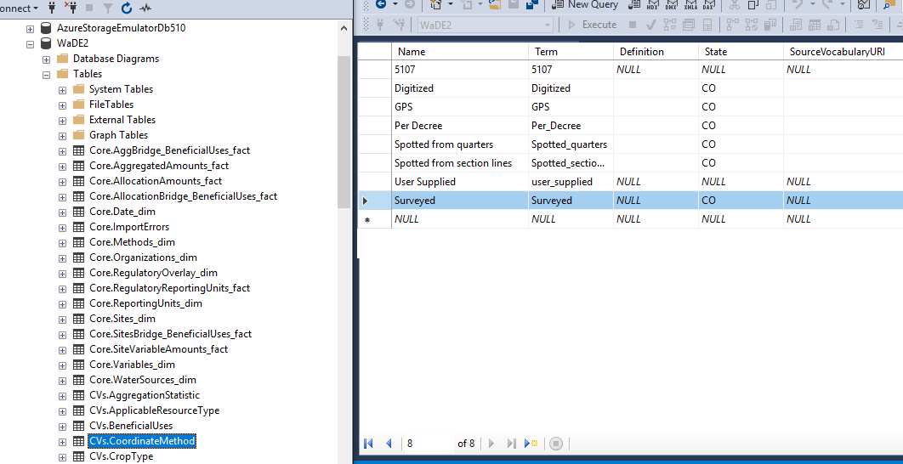
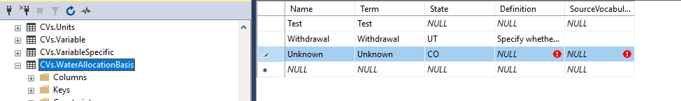

## Steps to Set up WaDE 2.0 Envionment (data importer and database) on a local machine 
Written and tested by Tseganeh Gichamo, PhD

1. Download and install MS SQL Server 2017 Express
(I installed the ‘basic’ package)
https://www.microsoft.com/en-us/sql-server/sql-server-editions-express
2. Download and install Sql Server Managment Studio 2018 (SSMS)
https://docs.microsoft.com/en-us/sql/ssms/download-sql-server-management-studio-ssms?view=sql-server-2017
3. Install Azure storage emulator
https://docs.microsoft.com/en-us/azure/storage/common/storage-use-emulator
4. Install Azure storage explorer
https://azure.microsoft.com/en-us/features/storage-explorer/
5. Install Visual Studio Community, including every workload related to Azure (e.g., Azure development)
https://visualstudio.microsoft.com/free-developer-offers/
6.  Install .NET Core SDK 2.2.402 (I used Windows x64 Installer)
https://dotnet.microsoft.com/download/dotnet-core/2.2
7. Make sure SQL server is started. 
In Search bar -> write “services” -> go to SQL Server -> double click on it ->start
  

 

8. Start the SQL server management studio (SSMS). 
Make sure you can connect to database engine using Windows Authentication (here "RABBIT" is my PC)

  
9. Import WaDE2.0.bacpac to SQL data base
	In SSMS, right click on Databases - > Import Data-tier applications - > 
	(Renamed WaDE2.0 to WaDE2)

1  

2 

 
9.2 
(This and #9.3 below are not really important once the current WaDE db copy is fixed to include ‘Surveyed’ in the CoordinateMethod CV)

In SSMS, WaDE2 - > Tables -> CVs.CoordinateMethod
Add a new row for “Surveyed” Coordinate method
 

9.3 Similarly insert into table “CVs.WaterAllocationBasis”, a row for “Unknown”
 

10. Initialize storage emulator
10.1 Start command line as administrator 
10.2 Specify the SQL server to init (here "RABBIT" is my PC)
"C:\Program Files (x86)\Microsoft SDKs\Azure\Storage Emulator\AzureStorageEmulator.exe" init /server RABBIT\SQLEXPRESS
 

11. Start Storage emulator (Same command line as in # 10)
"C:\Program Files (x86)\Microsoft SDKs\Azure\Storage Emulator\AzureStorageEmulator.exe" start

12. Open Storage explorer 
12.1 Open Connect Dialog 
12.2 For “How do you want to connect to your storage account or service?”, select “Attach to a local emulator”
 

13. Create a blob container “normalizedimports” in the storage emulator.
In storage explorer, expand Storage Accounts, and right click on Local-1 (key) -> Blob Containers - > Create blob container ->
Specify container name “normalizedimports”
 
 
14. While ‘normalizedimports’ is selected, select Upload -> Upload folder, and choose the folder where the input csv files are located, and upload the input data to the storage emulator.
 

15. Get the WaDE API source codes from https://github.com/WSWCWaterDataExchange/WaDE2.0/tree/develop 

16. Open Visual Studio, and open the solution “WaDE2.0-develop\source\WaDE.sln"

17. In Visual Studio Solution Explorer, under projects “WaDEApiFunctions” and “WaDEImportFunctions”, edit the file ‘local.settings.json’ to add connection string for the local database  
 
 

18. Build the Visual Studio Solution 
 

19. In Visual Studio, load WaDEImportFunctions and run
(If prompted by Windows, allow Windows firewall access the functions)
 
Wait till you get the following screen
 

20. Open a web browser and go to the following link (“NewColoradoDataFiles” is the folder uploaded into the storage emulator)
http://localhost:7071/api/LoadWaterAllocationData?runid=NewColoradoDataFiles
If everything goes well, you will see a screen like the following
 

Go to the SSMS and check the WaDE2 tables to see the uploaded values.
