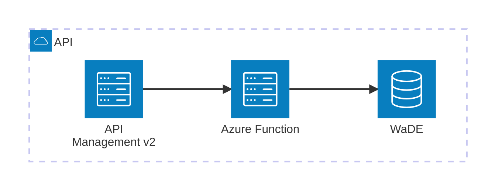

[Project Setup](../../../README.md)

# WaDE API Functions

This project contains a set of Azure Functions that implement the OGC API Features and Environmental Data Retrieval (EDR) specifications. These functions provide endpoints for accessing various water-related data collections, including time series, sites, rights, and overlays.

## Functions Overview

### DiscoverabilityFunction

- **LandingPage**: `GET` `/` Provides links for discoverability of the API.
- **Conformance**: `GET` `/conformance` Lists the conformance classes supported by the API.
- **Collections**: `GET` `/collections` Lists the available collections in the API.

### TimeSeriesFunction

- **GetTimeSeriesCollectionMetadata**: `GET` `/collections/timeseries` Retrieves metadata for a time series collection.
- **SearchTimeSeries**: `GET` `/collections/timeseries/items` Searches for time series items based on query parameters. Response is GeoJSON Feature Collection.
- **SearchTimeSeriesInArea**: `GET` `/collections/timeseries/area` Searches for time series items within a specified. Response is GeoJSON Feature Collection.
- **GetTimeSeries**: `GET` `/collections/timeseries/items/{featureId}` Retrieves a specific time series item by its feature ID. Response is GeoJSON Feature.

<details>
    <summary>Feature Properties Example</summary>
    ```json
    {
        "organization": {
            "organizationUuid": "NVssro_O1",
            "organizationPurview": "Manager of Nevada's water resources",
            "organizationWebsite": "http://water.nv.gov/index.aspx",
            "organizationPhoneNumber": "775-684-2800",
            "organizationContactName": "Nevada Division of Water Resources",
            "organizationContactEmail": "bmcmenamy@water.nv.gov",
            "state": "NV"
        },
        "variableSpecific": {
            "variableSpecificUuid": "NVssro_V1",
            "variableSpecificCv": "Discharge Flow_Daily_Discharge_Surface Water",
            "variableSpecificWaDEName": "Reservoir and Observation Sites",
            "variableCv": "Discharge Flow",
            "variableWaDEName": "Discharge Flow",
            "aggregationStatisticCv": "Average",
            "aggregationInterval": 1.0,
            "aggregationIntervalUnitCv": "Daily",
            "reportYearStartMonth": "1",
            "reportYearTypeCv": "CalendarYear",
            "amountUnitCv": "CFS",
            "maximumAmountUnitCv": "CFS"
        },
        "waterSource": {
            "waterSourceUuid": "NVssro_W116",
            "waterSourceNativeId": "WaDENV_WS115",
            "waterSourceName": "Ruby Valley Spring System",
            "waterSourceTypeCv": "Surface Water",
            "waterQualityIndicatorCv": "Surface Water"
        },
        "method": {
            "methodUuid": "NVssro_M1",
            "methodName": "Surface Water Monitoring Measures",
            "methodDescription": "Measurement data is provided by reporting agencies and by regular site visits from NDWR staff.",
            "methodTypeCv": "Measured",
            "methodNemiLink": "https://data-ndwr.hub.arcgis.com/datasets/NDWR::surface-water-monitoring-measures/about",
            "applicableResourceTypeCv": "Surface Water"
        },
        "timeframeStart": "2016-06-17T00:00:00",
        "timeframeEnd": "2016-06-17T00:00:00",
        "reportYear": "2016",
        "amount": 7.85,
        "populationServed": null,
        "powerGeneratedGWh": null,
        "irrigatedAcreage": null,
        "irrigationMethod": null,
        "cropType": null,
        "communityWaterSupplySystem": null,
        "sdwisIdentifier": null,
        "associatedNativeAllocationIDs": null,
        "customerType": null,
        "allocationCropDutyAmount": null,
        "primaryUseCategoryCv": "Discharge",
        "primaryUseCategoryWaDEName": "Other",
        "powerType": null,
        "site": {
            "siteUuid": "NVssro_S1151",
            "siteNativeId": "7926.0",
            "siteName": "176  N27 E58 31BBB 1",
            "coordinateMethodCv": "Unspecified",
            "epsgCodeCv": "4326",
            "county": "Elko",
            "podOrPouSite": "Observation Site",
            "waterSources": [
            {
                "waterSourceUuid": "NVssro_W116",
                "waterSourceNativeId": "WaDENV_WS115",
                "waterSourceName": "Ruby Valley Spring System",
                "waterSourceTypeCv": "Surface Water",
                "waterQualityIndicatorCv": "Surface Water"
            }
            ]
        }
    }
    ```
</details>

### WaterSitesFunction

> OGC API requires `datetime` filter so the swagger.json supports it, but the filter is actively ignored because sites don't have temporal data.

- **GetSiteCollectionMetadata**: `GET` `/collections/sites` Retrieves metadata for a site collection.
- **GetWaterSites**: `GET` `/collections/sites/items` Searches for water site items based on query parameters. Response is GeoJSON Feature Collection.
- **GetWaterSitesInArea**: `GET` `/collections/sites/area`Searches for water site items within a specified area. Response is GeoJSON Feature Collection.
- **GetWaterSite**: `GET` `/collections/sites/items/{featureId}` Retrieves a specific water site item by its feature ID. Response is GeoJSON Feature.

### RightsFunction

- **GetRightsCollectionMetadata**: `GET` `/collections/rights` Retrieves metadata for a water rights collection.
- **GetRights**: `GET` `/collections/rights/items` Searches for rights items based on query parameters. Response is GeoJSON Feature Collection.
- **GetRightsInArea**: `GET` `/collections/rights/area` Searches for rights items within a specified area. Response is GeoJSON Feature Collection.
- **GetWaterRight**: `GET` `/collections/rights/items/{featureId}`Retrieves a specific rights item by its feature ID. Response is GeoJSON Feature.

### OverlaysFunction

> OGC API requires `datetime` filter so the swagger.json supports it, but the filter is actively ignored because sites don't have temporal data.

- **GetOverlaysCollectionMetadata**: `GET` `/collections/overlays` Retrieves metadata for an overlays collection.
- **GetOverlays**: `GET` `/collections/overlays/items` Searches for overlay items based on query parameters. Response is GeoJSON Feature Collection.
- **GetOverlaysInArea**: `GET` `/collections/overlays/area` Searches for overlay items within a specified area. Response is GeoJSON Feature Collection.
- **GetOverlay**: `GET` `/collections/overlays/items/{featureId}` Retrieves a specific overlay item by its feature ID. Response is GeoJSON Feature.

## OGC API Features and EDR Compliance

These functions are designed to comply with the OGC API Features and EDR specifications, providing standardized access to geospatial and environmental data. The endpoints support common query parameters and response formats as defined by the specifications.

# Deployment

The azure functions are deployed using GH Actions. Any APIM configuration is done manually.

# Hosting



### API Management

- Name: `WaDE OGC API`
- API URL suffix: `api`

Base policy requires forwarding the request url from APIM to Azure Function so we can properly construct links.

```xml
<set-header name="X-WaDE-OriginalUrl" exists-action="append">
    <value>@(context.Request.OriginalUrl.ToString())</value>
</set-header>
```

# Validating Compliance

Currently validating the API's compliancy with OGC is done manually using their [online service](https://cite.opengeospatial.org/teamengine/viewSessions.jsp). But you can also clone the following repositories if you want to run the tests locally.

- https://github.com/opengeospatial/ets-ogcapi-features10 (Local)
- https://github.com/opengeospatial/ets-ogcapi-edr10 (Local)
